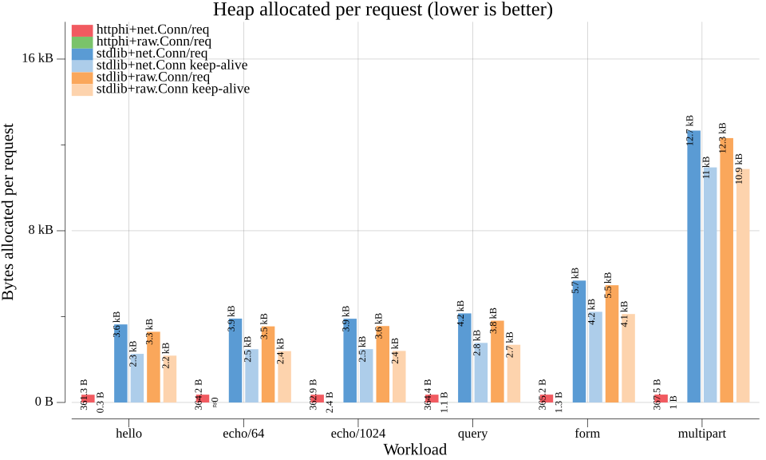
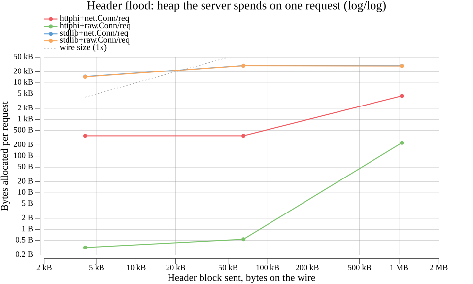
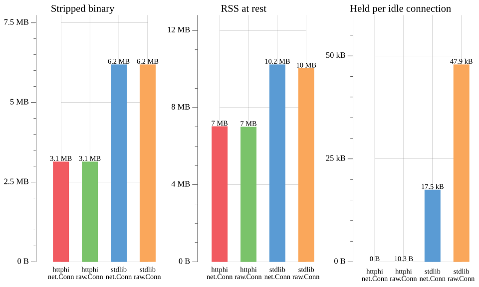
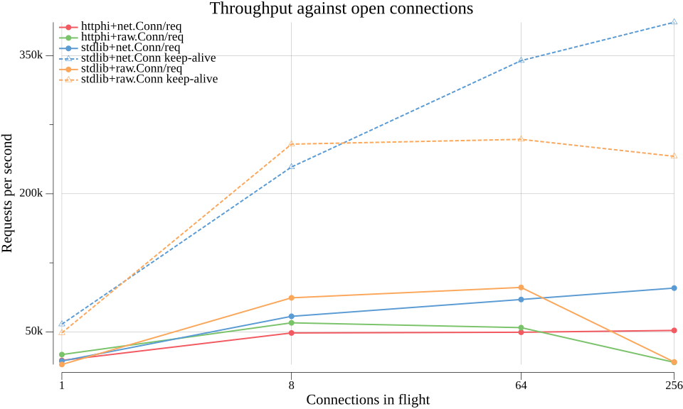
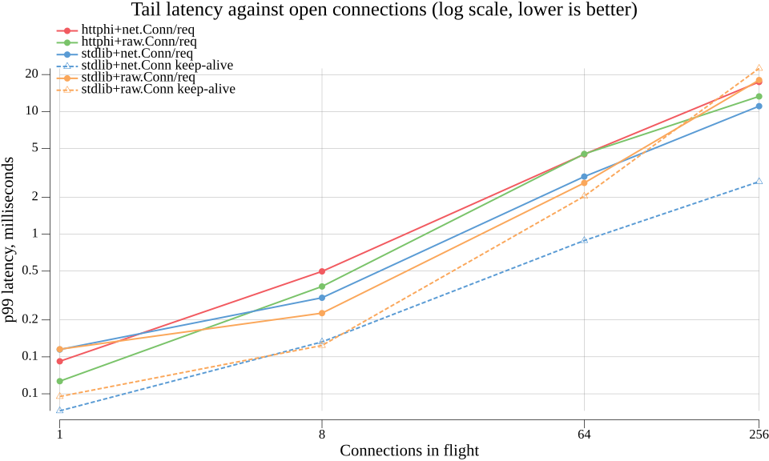

# httpbench

Measures what an HTTP server implementation costs, one server binary per implementation.

Each implementation lives in [implementations/](implementations/) and is built into a binary of its
own, so the size of that binary, the memory the process holds and the threads it starts are results
rather than properties of a harness with every stack linked into it. Today that is
[httφ](https://github.com/soypat/lneto) (`httphi`) and the standard library's `net/http`
(`stdlib`), each measured over two transports: Go's `net` package and `rawsock`, a blocking-syscall
socket that skips the runtime's network poller.

```sh
./bench.sh                 # build, measure everything, redraw every figure
./bench.sh -requests=2000  # anything here goes to `httpbench run`
```

That writes `results.json`, `REPORT.md` and the figures below.

### Running server by itself
Run below to run just the httphi HTTP implementation and then go to [http://localhost:8080/metrics](http://localhost:8080/metrics) to visualize heap metrics (all examples have same endpoints)
```
go run ./implementations/httphi
go run ./implementations/nethttp
```

## The figures

### Heap allocated per request



How much memory a server allocates to answer one request, per workload — the headline number, and
where a stack that takes its buffers up front and one that allocates per request differ by three
orders of magnitude.

### Header flood



What one request costs as its header block grows to 4 kB, 64 kB and 1 MB, against the dashed 1×
line a server that spends exactly what it was sent would follow — a bounded server answers 431 and
stays flat, an unbounded one tracks the line.

### Static footprint



Three costs a server has before it serves anything: the size of its stripped binary, the memory the
process holds at rest, and the memory it holds for one connection that is open and idle.

### Throughput



Requests answered per second as the number of connections in flight grows from 1 to 256.

### Tail latency



The p99 latency at each of those connection counts — the answer a slow request gets, rather than
the average that hides it.

## Acronyms

- **RSS** — *resident set size*: the memory of a process actually held in RAM, read from
  `/proc/<pid>/status`. It counts everything, so it needs no cooperation from the server and works
  for an implementation written in any language. **Peak RSS** (`VmHWM`, high water mark) is the
  largest it ever got.
- **heap** — memory a Go program allocated for itself, reported by the server's own `/metrics`
  endpoint. Smaller than RSS, which also includes the binary, the stacks and what the allocator has
  taken from the OS but not handed out.
- **p50 / p99** — the latency half of the requests beat, and the latency 99% of them beat. p99 is
  the tail: what a request gets when the server is at its worst.
- **conn/req** — one connection per request, opened and closed around each one. Every
  implementation supports it, so it is the mode they are compared in.
- **keep-alive** — every request of a connection sent down the same socket, measured wherever the
  server serves it.
- **net.Conn / raw.Conn** — the transport: Go's `net` package, or `rawsock` blocking syscalls.
- **GC** — garbage collection; the report gives cycles per thousand requests and the fraction of
  CPU spent on it.
- **431** — HTTP "Request Header Fields Too Large", the answer a bounded server gives a flood.

## What is checked

Every answer is verified before it is counted: status, framing by `Content-Length`, and the body
itself — echoed bytes, decoded query parameters, decoded form pairs, and each part of a multipart
body with its name and filename. A stack that skips the decoding fails the row rather than posting
a good time for it.

A shared request corpus with a response digest, which would make this a conformance test as well,
is still to come.
